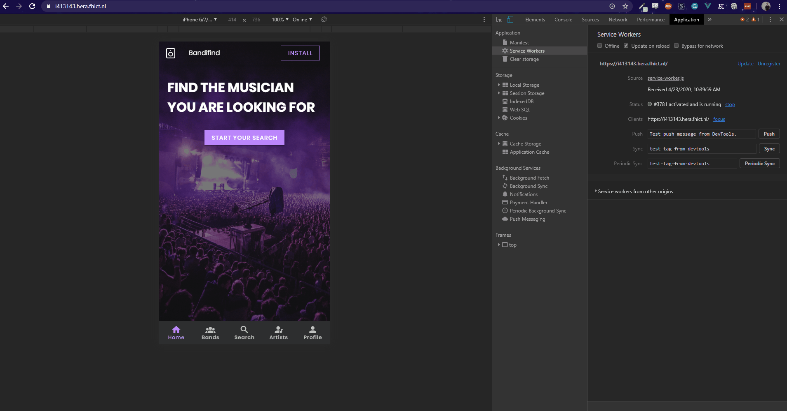

# Bandifind

A Progressive Web App platform where bands find their musicians and musicians find a new band.

## Description

Bandifind is an app made in a span of 8 weeks. The idea of the app is to match bands with musicians and vice versa. In those 8 weeks we delivered an MVP and a RAT (Riskiest Assumption Test).

## Functionalities

### Offline page



### Service worker re-initialisation pop-up


### Custom install button


### Artist registration


### Search functionalies


## Project setup
```
npm install
```

### Compiles and hot-reloads for development
```
npm run serve
```

### Compiles and minifies for production
```
npm run build
```

### Run your unit tests
```
npm run test:unit
```

### Lints and fixes files
```
npm run lint
```
